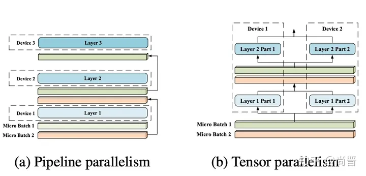
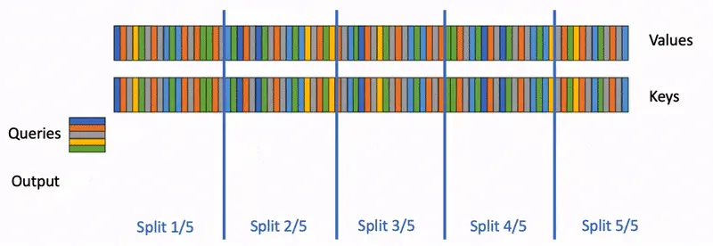

# 大模型推理加速技术——计算加速

## 总览

计算加速：

- 通过**改进算法**和**硬件利用率**来提高效率
- 不影响模型输出的质量
- 让模型“算得更快”

主要方法：

- 算子融合
- KV Cache
- Kernel 优化
- 分布式推理

## 瓶颈

### Attention

对于GPT系列等主流的Decoder-only大模型来说，推理过程分为两个阶段：

- Context Phase/Prefill Phase 上下文阶段/预填充阶段
  - 计算整个Prompt的**自注意力**，
  - Q、K、V大小皆为`[seq_len, emb_dim]`
  - 只需要进行一次，生成第一个Token
- Genneration Phase/Decoding Phase 生成阶段/解码阶段
  - 每生成一个token就要计算一次，
  - Q大小为`[1, emb_dim]`，
  - K、V大小为`[n, emb_dim]`，代表所有前文的embedding
  - 计算的是**当前token**和**所有前文**的注意力

### 计算瓶颈

- 大模型通常需要处理很长的输入输出，输入越长，模型需要计算的矩阵尺寸越大
- 生成阶段，每个token的生成都依赖于前面所有的计算，只能一个个token生成，不能并行计算

即，Attention的计算是一个** $ O(n^{2}) $ ​**的操作，计算**时间复杂度高**，并且**无法并发**。

### 优化目标

- 更低的**延迟（Latency）**
  - 单个请求返回的时间
- 更高的**吞吐量（Throughput）**
  - 一定时间内处理请求的总量

#### 技术分类

- 计算加速
  - 通过改进算法和硬件利用率来提高效率
  - 不影响模型的输出质量
  - 让模型“算得更快”
- 模型压缩
  - 改变模型结构，减少部分计算（如稀疏Attention）或降低计算精度（量化），换来更快的推理速度和更低的资源消耗
  - 但可能会影响输出质量
  - 让模型“算得更少”

## 计算加速

在模型结构固定的情况下，可做的优化如以下三种：

- 减少需要执行的指令数量 - 计算侧优化
  - 减少不必要或重复的计算
- 充分利用硬件的并发度 - 计算侧优化
  - SIMD
  - 利用多核机制，同时执行多条指令
- 加速内存I/O速度 - 内存I/O优化
  - 利用缓存局部性加速内存读取指令的执行速度
  - 减少不必要的内存读写

### 计算侧优化

#### KV Cache

在自回归Decoding过程中，避免重复计算之前步的K、V，而是通过一个Cache存放。

#### Kernel优化和算子融合

争取将整个Attention或更多步操作在一个kernel中实现。

#### 分布式推理

- 数据并行
  - 模型放在多个GPU上，每个GPU都包含完整模型
  - 将数据集分成多份，每个GPU负责推理一部分数据
- 流水线并行
  - 将模型纵向拆分，每个GPU只包含模型的一部分层
  - 数据在一个GPU完成运算后，将输出传给下一个GPU继续计算
- 张量并行
  - 将模型横向拆分，将模型每一层拆分开，放在不同的GPU上
  - 每一层的计算都需要多个GPU合作完成

> 张量并行一般使用NVIDIA Megatron库，模型内部结构改为使用Megatron的：
>
> - ColumnParallelLinear
> - RowParallelLinear
> - ParallelMLP
> - ParallelAttention
> - …

### 内存I/O优化

#### Flash Attention

在进行Attention计算时，Q、K、V都是非常大的矩阵，直接进行矩阵乘法运算非常缓存不友好；

可以考虑对矩阵进行分块乘法，每次只计算一个小的block，以保证block可以放进SRAM（一级缓存）而非HBM（二级缓存）中。 - 大部分矩阵乘法kernel的经典实现思路

Flash Attention更进一步。观察到Attention计算分为三步：

1. 从HBM读取Q、K，计算 $ S=QK^{T} $ ，将S写回HBM
2. 从HBM读取S，计算 $ P=Softmax(S) $ ，将P写回HBM
3. 从HBM读取P和V，计算 $ O=PV $ ，将O写回HBM

过程中需要读三次HBM写三次HBM；那么自然可以想到是否有办法将读写次数各降至一次？

- 如果Attention只是简单的矩阵乘法，可以通过分块计算的方法避免写回HBM
- 但是由于Softmax的存在，导致无法这样做
  - 因为Softmax需要计算矩阵中每一行元素的最大值
  - 所以必须等待所有分块遍历完成后才能计算下一步

Flash Attention巧妙地利用了类似于动态规划的技巧，实现了online softmax：

- 在一个循环中计算出一个分块的最终结果
- 算法在遍历过程中需要不断地对中间结果重新计算，但得益于不需要多次读HBM，在增大计算量的情况下仍然可以提升运算速度

> 可以通过Flash Attention库调用它的kernel
>
> PyTorch官方也对Flash Attention提供了官方支持

#### Flash Decoding

Flash Attention优化的是大矩阵乘法，矩阵越大优化效果越好。

但在线推理场景中，输入的batch_size为1，因此Q实际上是一个向量而非矩阵：

- 在这种场景下，Flash Attention无法充分地利用GPU的并发能力

而Flash Decoding通过以seq_len为维度并发：

- 将K和V分成多个部分
- 并发地与Q相乘

相比于Flash Attention，Flash Decoding在在线单次推理且上下文长度较长时效果更好。

> 可通过FlashAttention库或者xFormers的attention kernel来使用Flash Decoding。

#### Continuous Batching

> 解决批量推理过程中KV Cache的存储浪费问题

批量推理过程中一般使用固定的Batch size，将多个请求一起推理

在分配KV Cache时，由于不同请求可能有不同的输入长度，而且无法预知输出长度，因此KV Cache中tensor的`seq_len`维无法固定，导致分配只能按照最大长度，即分配`[batch_size,max_seq_len,inner_dim]`形状的cache，但：

- 不是每个请求的长度都达到`max_seq_len`，因此KV Cache中的很多内存都被浪费掉了
- 导致即使一些请求的输出长度很短，但它们仍然需要等待哪些输出长度更长的请求都结束后才能够返回

为了解决这种所谓“Static Batching”中存在的问题，提出了Continuous Batching策略：

> 也叫Dynamic Batching或Inflight Batching

- 允许输出较短的请求提前结束
- 由新请求占用已结束请求的KV Cache空间

在批量推理场景中，Continuous Batching可以将模型的吞吐量提升两到三倍。

> 当前主流的推理框架如HuggingFace TGI、Ray serve、vLLM、TensorRT-LLM等都支持Continuous Batching策略。

#### Paged Attention

> From vLLM

推理中存在三种内存浪费：

- Reservation：
  - 由于不确定每个请求的输出长度，而需要给每个请求预留`max_seq_len`的空间
- Internal Fragmentation：
  - 在Static Batching策略下，一个请求结束时，其剩余的空间就被浪费掉了
- External Fragmentation：
  - 由于KV Cache是一个巨大的矩阵，且必须占用连续内存
  - 因此如果操作系统只分配大的连续内存 ，势必有很多小的内存空间被浪费掉

Continuous Batching可以部分解决Internal Fragmentation问题，但剩余两个问题仍然存在

因此提出了Paged Attention，借鉴了操作系统中通过Page管理虚拟内存的思想：

- 将KV Cache分割为固定大小的Block
- blocks不需要存储在连续内存中，而是由同意的内存分配器管理
- 请求按需申请内存，不需要预先留好`max_seq_len`大小的内存
  - 解决了Reservation的浪费
- 请求结束后释放掉自己的blocks
  - 解决了Internal Fragmentation
- 系统只需要分配小的blocks
  - 解决了External Fragmentation

> 使用Paged Attention可以将模型批量推理的吞吐量再提升3倍以上，达到Static Batching的6倍

另一个好处是，不同的请求可以共享Cache Block：

- 如在Beam Search场景中，需要对同一个Prompt生成多个结果
- 这些子请求就可以共享同一批Prompt Cache

> Paged Attention可以将Beam Search的吞吐量提升 10倍以上

> 可以通过官方vLLM库使用Paged Attention；NVIDIA的TensorRT-LLM和Microsoft的Deepspeed-MII库也对部分模型提供 了支持

#### SplitFuse

如果要在F个前向推理中处理P个token，最高效的分配策略是将它们均分：

- 每个前向推理处理 $ \frac{P}{F} $ 个token

但在模型推理过程中，需要先在context phase一次性处理整个prompt，然后再在generation phase一个个生成token，是不符合最优策略的

因此提出了SplitFuse：

- 将长的 Prompt 分割成多个短的输入，分在多个前向推理处理
  - 只有最后一次推理会生成新的token
- 短的Prompt会被合并在一起进行前向推理
- 保证每次前向推理的输入token数是固定的

> SplitFuse输入长度越长效果越明显；输入长度为2600时throughput可以达到vLLM的2.3倍
>
> 但vLLM不久前推出了PagedAttentionV2

> 目前被包含在DeepSpeed MII框架里

# 大模型推理加速技术——模型压缩

- 量化（Quantization）：使用低精度（ $ \le16 $ 位）存储模型权重
- 精简 Attention：通过一些变种Attention算法减少模型计算量

# 参考文献

- [大语言模型推理加速技术：计算加速篇 - 知乎 (zhihu.com)](https://zhuanlan.zhihu.com/p/666452391)