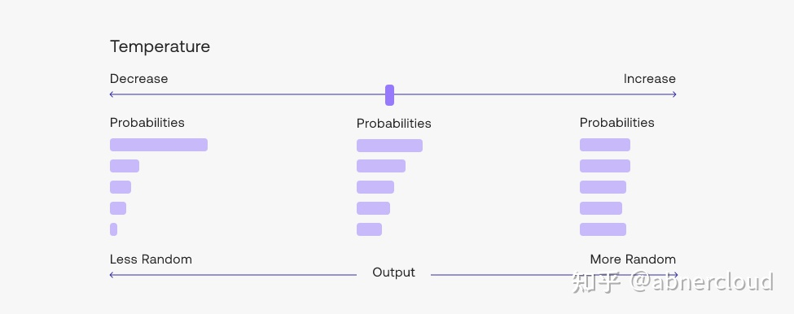
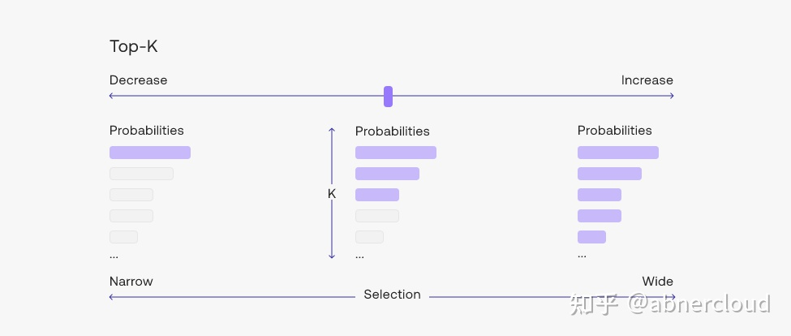
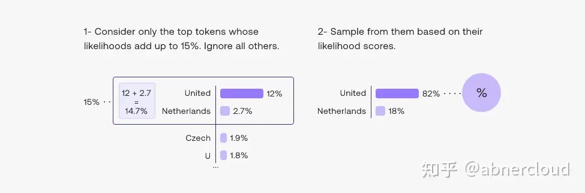

# LLMs

## GPT

## Transformer

### Attention is All You Need 原文设计

- Encoder-Decoder架构

- Encoder将输入序列$\mathbf{x}=(x_{1},…,x_{n})$映射为向量序列$\mathbf{z}=(z_{1},...,z_{n})$​

  - 输入文本先通过Input Embedding生成Word Embeddings
  - 然后添加Positional Encoding位置编码

- Decoder从给定的向量序列$\mathbf{z}$生成输出序列$\mathbf{y}=(y_{1},...,y_{m})$

  - 生成$\mathbf{y}$时，一次生成一个元素，每一步**自回归**
    - 自回归指前面步生成的结果元素也参与下一步的生成

- Encoder一个输入一个输出

  - 输入$\mathbf{x}$输出$\mathbf{z}$

- Decoder两个输入一个输出

  - 输入`z`以及之前步的输出序列元素
    - 输出序列元素也需要Embedding和位置编码

- 与RNN相比，更加适合GPU并行计算

- 模型：公式+参数

  - 公式：模型架构设计

  - 参数：由训练得来

    > GPT 3.5约1750亿参数

#### Multi-Head Attention/Masked Multi-Head Attention

- 注意力/自注意力

  - 注意力机制：Q与K算相关度，然后加权V并相加

  - 自注意力机制：Q、K、V都相等

    - 每个字都跟全文计算相似度

    - 然后加权相加输出

    - 考虑的是字词之间的相关性/字的重要性等等

    - > 与无监督的感觉蛮相似

## 相关技术

- 向量数据库、向量检索、LangChain、SK（Semantic Kernel）、Agent、RAG
- Fine-tune
  - 包括RLHF

## Fine-tune

1. 收集示范数据，并制定监督政策
   - 准备很多prompt
   - 用文本对输出进行监督
2. 收集比较数据，并训练奖励模型
   - Fine-tuning
   - 对模型生成的答案进行效果排序，用排序效果进行监督
3. 使用强化学习针对奖励模型优化策略

Lora？- Fine-tune

- 如何定义“好数据”？
- 多长的prompt-Answer对Fine-tune更加友好？
- 除了实际对话，还有什么更加自动化/规范化/标准化的评估模型的方式？

## 推理时参数

### 采样温度 Temperature

采样温度越高，输出随机性越大，选择概率低的token输出的可能性越大，更可能产生更具创新性/多样性的输出；

相对地，采样温度越低，输出随机性越小，模型更偏向于选择概率较高的选项，产生更准确、更确定性的输出。

- 如果模型开始自我重复，表明温度过低
- 如果模型开始偏离主题或给出无意义的输出，表明温度过高
- 可以针对不同的问题调整温度，但也许`temperature=1`是一个良好起点
- 随着序列变长，模型会对其预测自然更有信心，因此：
  - 可以在不偏离主题的情况下为长提示提高温度
  - 在短提示上使用高温可能会导致输出非常不稳定

### Top-p 采样

> 通常建议修改`temperature`或`top_p`其中之一，而不是同时修改两者。

“nucleus sampling”，核采样；使模型考虑具有`top_p`概率质量的token的结果。如：

- `top_p=0.1`表示只考虑包含在最高10%**概率质量**中的token。
  - 从概率最高的结果从上往下选，将概率相加，直到将要超过`top_p`时，停止选择；在这之前所有被选的结果即为通过`top_p`挑选的结果。
  - 如果概率密度特别大，即前几个结果的概率预测特别高，那么总体被挑选的结果的数量就会趋向于减少；反之亦然。

> 考虑概率质量而不是简单地取`top_k`个结果，能够动态地确定词汇候选池的大小，并且避免过于受限或者过于随机的生成结果。
>
> - Top-K
>   
>   
> - Top-P
>   
>   

## 混合专家模型（MoE）与门控机制

假设有$M$个专家网络$(E_{1},E_{2},...,E_{M})$，每个专家接收相同的输入$\mathbf{x}$，并各自产生潜在的输出$E_{i}(\mathbf{x})$；

门控机制的任务是基于输入$\mathbf{x}$生成一组归一化的权重$(g_{1}(\mathbf{x}),g_{2}(\mathbf{x}),...,g_{M}(\mathbf{x}))$​，作为融合输出时每一个专家的重要性。

1. 门控网络计算权重：
   - 门控网络通常是一个较小的神经网络，可以是MLP或者其他适当的函数映射。
2. 归一化权重：
   - 上一步网络生成的权重是未归一化的
   - 为了确保权重之和为1，通常会将未归一化的权重向量进行softmax操作，从而得到概率分布式的权重
3. 专家输出及混合：
   - 根据门控网络给出的归一化权重，加权求和所有专家的输出

在实际的MoE实现中，为了提高效率和减少计算成本 ，通常会采用稀疏激活策略：

- 如Top-K门控：
  - 仅选取权重最高的K个专家进行计算
- 在Noisy Top-K门控中，还会添加一定噪声以促进专家之间的竞争和多样性
