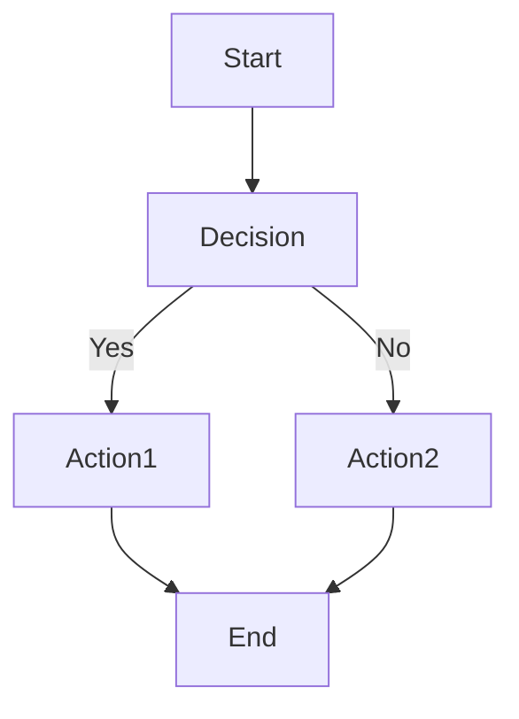
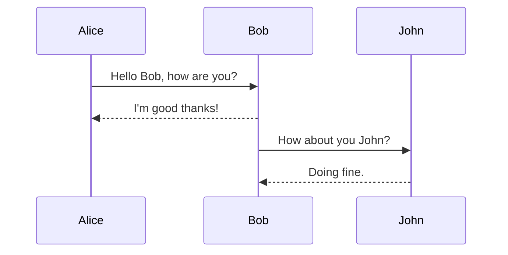
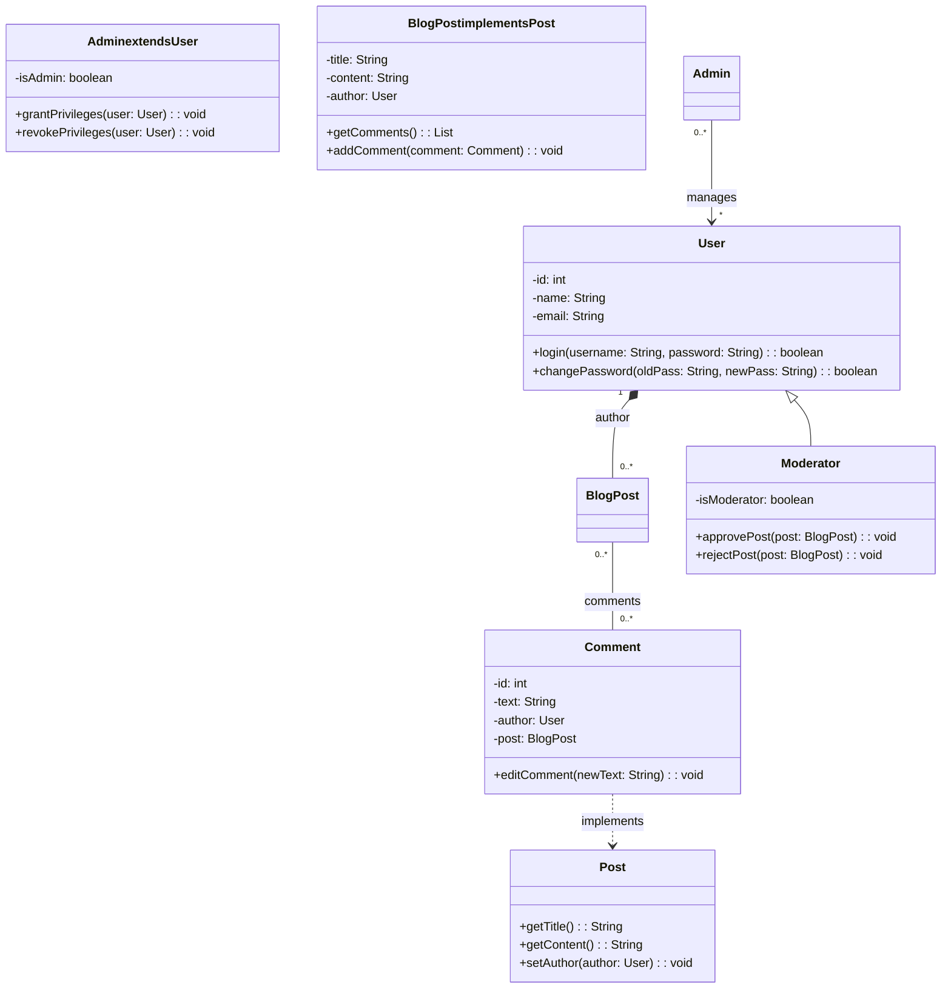
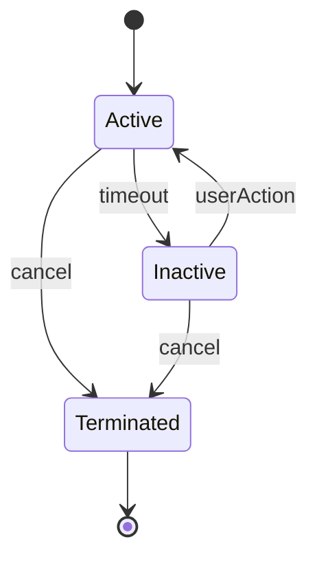
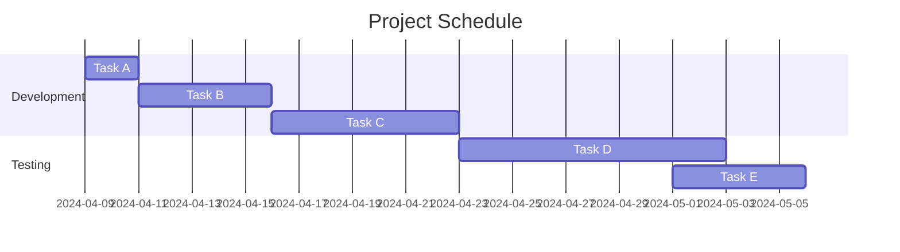

# Mermaid 示例

Mermaid 是一种轻量级的、基于 JavaScript 的图表绘制工具，它允许用户使用简单的文本语法来描述各种类型的图表，如流程图、序列图、甘特图、类图、状态图等。这种文本语法类似于 Markdown，使得编写和维护图表变得非常直观且易于集成到文档、博客、笔记等文本编辑环境中。Mermaid 支持在线渲染和本地渲染，常被集成到诸如 GitHub、GitLab、Typora、VS Code 等众多开发者工具和文本编辑器中。

以下是一些 Mermaid 常用的图表类型及对应的基本语法实例：

### **流程图 (Flowchart)**

流程图用于描述一系列步骤或决策过程。基本语法包括定义节点（矩形、菱形、圆圈等）以及连接它们的箭头。



解释：
- `graph TD` 定义这是一个顶点向下（Top-Down）布局的流程图。
- `Start`, `Decision`, `Action1`, `Action2`, `End` 是节点名，分别代表流程的起始、决策点、行动步骤和结束。
- `-->` 表示箭头方向，连接节点。
- `|Yes|` 和 `|No|` 是决策箭头上的标签，表示决策条件。

### **序列图 (Sequence Diagram)**

序列图用于描绘对象之间的交互顺序，特别适用于展示软件系统中消息传递的过程。



解释：
- `sequenceDiagram` 定义这是一个序列图。
- `Alice ->> Bob: Hello Bob, how are you?` 描述 Alice 向 Bob 发送消息 "Hello Bob, how are you?"，箭头 `->>` 表示同步消息。
- `Bob-->>Alice: I'm good thanks!` 使用 `-->>` 表示异步回复。
- 类似的结构描述了 Bob 与 John 之间的交互。

### **类图 (Class Diagram)**

Mermaid 的类图语法允许您使用文本描述来绘制 UML 类图，表示类、接口、它们之间的继承、实现、关联、聚合、组合和依赖关系。以下是对 Mermaid 类图语法的详细讲解：

#### **基本结构**

```
classDiagram
    // 类、接口定义和关系描述
```

开始一个类图定义需使用关键字 `classDiagram`，后面跟具体的类、接口定义和它们之间的关系描述。

#### **类与接口定义**

##### **类 (Class)**

```
class ClassName {
    [-] attribute1: Type
    [+] operation1(param1: Type, param2: Type): ReturnType
}
```

- `ClassName`: 类名，应使用有意义的标识符。
- `[-] attribute1: Type`: 私有属性（字段），`[-]` 表示私有访问权限，`attribute1` 是属性名，`: Type` 表明其数据类型。
- `[+] operation1(param1: Type, param2: Type): ReturnType`: 公共方法，`[+]` 表示公共访问权限，`operation1` 是方法名，`(param1: Type, param2: Type)` 列出参数及其类型，`: ReturnType` 指定返回值类型。

##### **接口 (Interface)**

```
interface InterfaceName {
    + method1(param1: Type): ReturnType
}
```

- `InterfaceName`: 接口名。
- `+ method1(param1: Type): ReturnType`: 接口方法，`+` 表示接口成员默认为公有，方法定义与类中方法类似。

#### **关系描述**

##### **继承 (Inheritance)**

```
BaseClass <|-- DerivedClass
```

- `BaseClass <|-- DerivedClass`: 表示 `DerivedClass` 继承自 `BaseClass`。

##### **实现 (Implementation)**

```
ConcreteClass ..> InterfaceName : implements
```

- `ConcreteClass ..> InterfaceName`: 表示 `ConcreteClass` 实现 `InterfaceName` 接口。
- `: implements`: 可选的标签，明确表示这是实现关系。

##### **关联 (Association)**

```
ClassA -- ClassB : associationLabel
```

- `ClassA -- ClassB`: 表示 `ClassA` 与 `ClassB` 之间存在关联关系。
- `: associationLabel`: 可选的标签，描述关联关系的性质或角色。

##### **聚合 (Aggregation)**

```
ContainerClass o-- PartClass : aggregationLabel
```

- `ContainerClass o-- PartClass`: 表示 `ContainerClass` 与 `PartClass` 之间存在聚合关系，`o` 表示空心菱形，表示 `PartClass` 可以独立存在，即使没有 `ContainerClass`。
- `: aggregationLabel`: 可选的标签，描述聚合关系的性质或角色。

##### **组合 (Composition)**

```
ContainerClass *-- PartClass : compositionLabel
```

- `ContainerClass *-- PartClass`: 表示 `ContainerClass` 与 `PartClass` 之间存在组合关系，`*` 表示实心菱形，表示 `PartClass` 的生命周期完全依赖于 `ContainerClass`，`ContainerClass` 销毁时 `PartClass` 也会随之销毁。
- `: compositionLabel`: 可选的标签，描述组合关系的性质或角色。

##### **依赖 (Dependency)**

```
UsingClass --> UsedClass : dependencyLabel
```

- `UsingClass --> UsedClass`: 表示 `UsingClass` 依赖于 `UsedClass`，可能是通过使用其方法、属性或实例化对象。
- `: dependencyLabel`: 可选的标签，描述依赖的具体性质或用途。

#### **示例**



这个类图展示了在一个简单的博客系统中涉及的类、接口和它们之间的关系。

1. **User 类**：
   - 属性：`id`（用户ID）、`name`（用户名）、`email`（电子邮件地址）。
   - 方法：`login`（接收用户名和密码，验证并返回登录成功与否）、`changePassword`（接收旧密码和新密码，更新用户密码）。
   - 用户是整个系统的基础实体，具有登录和修改密码的能力。
2. **Admin 类**：
   - 继承自 `User` 类，额外包含属性 `isAdmin`（是否为管理员）。
   - 方法：`grantPrivileges`（给指定用户授予特权）、`revokePrivileges`（撤销指定用户的特权）。
   - 管理员除了具备普通用户的功能外，还负责管理其他用户的权限。
3. **Post 接口**：
   - 定义了博客文章的基本行为：获取标题 (`getTitle`)、获取内容 (`getContent`) 和设置作者 (`setAuthor`)。
   - 作为抽象概念，它代表任何类型的文章，具体实现由其他类提供。
4. **BlogPost 类**：
   - 实现了 `Post` 接口，包含具体属性：`title`（标题）、`content`（内容）、`author`（作者）。
   - 添加了方法：`getComments`（获取文章的所有评论）、`addComment`（添加新的评论到文章）。
   - 博客文章是具体的文章类型，具有标题、内容、作者及与其相关的评论列表。
5. **Comment 类**：
   - 属性：`id`（评论ID）、`text`（评论文本）、`author`（评论者）、`post`（所属文章）。
   - 方法：`editComment`（编辑评论的文本）。
   - 评论是针对某篇博客文章的用户反馈，有唯一的ID、文本内容、作者信息以及与之关联的文章。
6. **关系描述**：
   - **组合关系**：`User` 类与 `BlogPost` 类之间存在组合关系，表示一个用户可以撰写多篇博客文章，但每篇文章都有且仅有一个作者。关系标签为 `author`。
   - **聚合关系**：`BlogPost` 类与 `Comment` 类之间存在聚合关系，表示一篇博客文章可以有零个或多个评论，但每个评论只能属于一篇文章。关系标签为 `comments`。
   - **实现关系**：`BlogPost` 类实现 `Post` 接口，表示它提供了接口所要求的所有功能。
   - **依赖关系**：`Comment` 类依赖于 `Post` 接口，表明它需要遵循接口定义的行为规范。
   - **泛化关系**：`Admin` 类继承自 `User` 类，表示管理员是用户的一种特殊类型，拥有用户的所有属性和方法，同时增加了管理权限相关的属性和方法。
   - **关联关系**：`Admin` 类与 `User` 类之间存在关联关系，表示一个管理员可以管理多个用户，用标签 `manages` 表示这种管理关系。
7. **Moderator 类**：
   - 作为一个额外的类，`Moderator` 也继承自 `User` 类，具有 `isModerator` 属性和审核博客文章的方法：`approvePost`（批准文章发布）和 `rejectPost`（拒绝文章发布）。
   - 系统中的某些用户可能既是普通用户又是具有审核权限的版主，因此在类图中将 `Moderator`作为 `User` 的子类表示。

综上所述，此 Mermaid 类图清晰地描绘了一个博客系统中核心类、接口及它们之间的各种关系，有助于理解系统的静态结构和各组件之间的交互方式。

总结来说，Mermaid 类图语法通过简单的文本描述，使您能够在文档中快速绘制 UML 类图，有效地传达软件设计的静态结构。掌握这些基本语法和关系类型，您就能轻松创建复杂的类图以辅助设计、沟通和文档化工作。

### **状态图 (State Diagram)**

状态图描述一个对象在其生命周期内可能经历的各种状态以及触发状态变迁的事件。



解释：
- `stateDiagram-v2` 定义这是一个状态图（v2 版本）。
- `[*]` 表示初始状态。
- `Active`, `Inactive`, `Terminated` 是状态名。
- `[*] --> Active` 表示从初始状态进入 `Active` 状态。
- `Active --> Inactive: timeout` 表示在 `Active` 状态下，经过 `timeout` 事件后进入 `Inactive` 状态。
- 其他箭头表示其他状态变迁及其触发事件。

### **甘特图 (Gantt Chart)**

甘特图用于展示项目的任务安排和进度，包括任务开始和结束时间、持续时间以及依赖关系。



解释：
- `gantt` 定义这是一个甘特图。
- `dateFormat` 设置日期格式。
- `title` 指定图表标题。
- `section` 用于划分任务组。
- `Task A`、`Task B` 等定义具体任务，格式为 `任务名 : 任务ID, 开始日期, 结束日期[, 图标, 持续时间]`。
- `:after a1` 表示该任务在 `Task A` 完成后开始。

以上实例展示了 Mermaid 在绘制常见图表时的语法和用法。实际使用时，只需将这些文本语法插入支持 Mermaid 的环境中，如 Typora、GitHub Markdown、VS Code 等，即可自动渲染出对应的图表。Mermaid 提供了一种简洁、可读性强的方式来描述复杂的图表结构，极大地简化了文档中的可视化表达。